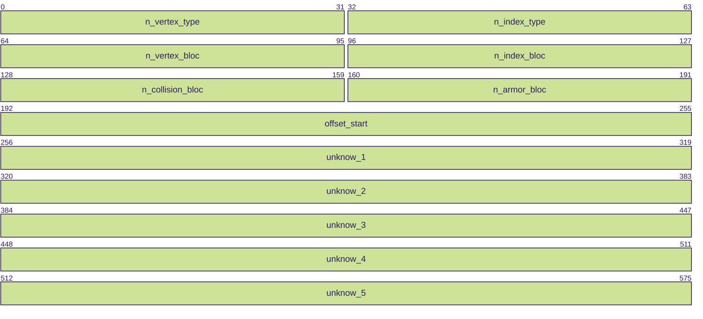

# WoWs .geometry Format.

## Introduction

TODO

## Convention

A **byte/8 bits** is represented as follows:
```
+====+
| XX |
+====+
```

A **variable length field** (ex: strings) is represented as follows:

```
|~~~~~~~~~~~~~~~~~~~~~~~~~~~~|
|           Field            |
|~~~~~~~~~~~~~~~~~~~~~~~~~~~~|
```

The boundary between two fields is marked as follows:

```
...=++=...
    ||
...=++=...
```

## Format

### Header



#### Field descriptions

| Field                      | Size    | Description                                                                                     |
|----------------------------|---------|-------------------------------------------------------------------------------------------------|
| `n_vertex_type`            | 32 bits | Number of vertex types                                                                          |
| `n_index_type`             | 32 bits | Number of index types                                                                           |
| `n_vertex_bloc`            | 32 bits | Number of vertex blocs                                                                          |
| `n_index_bloc`             | 32 bits | Number of index blocs                                                                           |
| `n_collision_bloc`         | 32 bits | Number of collision blocs                                                                       |
| `n_armor_bloc`             | 32 bits | Number of armor blocs                                                                           |
| `offset_1`                 | 64 bits | Offset to data start (always 72 bytes)                                                          |
| `unknown_1`                | 64 bits | Multiple of 8/64bits, value between ~80 and ~1200  | offset?                                    |
| `unknown_2`                | 64 bits | Multiple of 8/64bits, value between ~100 and ~2000 | offset?                                    |
| `unknown_3`                | 64 bits | Large value (few thousands to millions) | vertex count?                                         |
| `unknown_4`                | 64 bits | Large value (few thousands to millions), 0 if no collision bloc | vertex count collision block? |
| `unknown_5`                | 64 bits | Large value (few thousands to millions), 0 if no armor bloc     | vertex count armor block?     |

