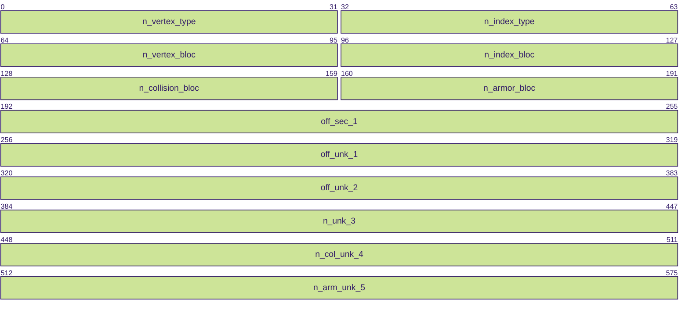
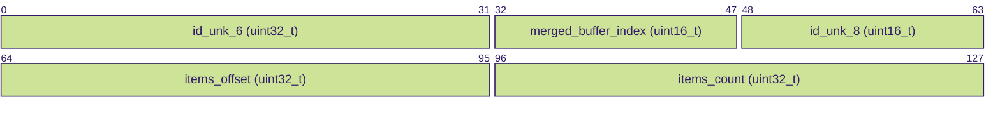
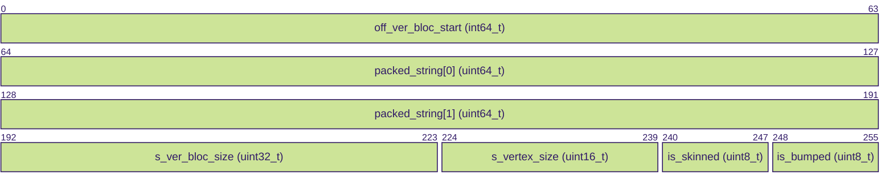
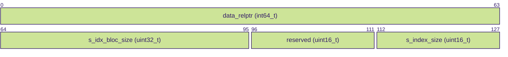

# WoWs .geometry Format

## Introduction

BigWorld engine `.geometry` format used by World of Warships for 3D model data.
Vertex and index data are compressed using **meshoptimizer** (ENCD blocks).

## File Layout

```
[Header 72 bytes]
[Vertex Bloc Mapping table: n_vertex_bloc × 16 bytes]    ← at off_sec_1
[Index Bloc Mapping table:  n_index_bloc  × 16 bytes]    ← at off_unk_1
[Vertex Type Metadata:      n_vertex_type × 32 bytes]    ← at off_unk_2
[Index Type Metadata:       n_index_type  × 16 bytes]    ← at n_unk_3
[ENCD vertex data blocs]    ← pointed to by Vertex Type Metadata
[ENCD index data blocs]     ← pointed to by Index Type Metadata
[Collision model data]      ← at n_col_unk_4 (if n_collision_bloc > 0)
[Armor model data]          ← at n_arm_unk_5 (if n_armor_bloc > 0)
```

## Format

### Header (72 bytes)


```mermaid
%%{init: { 'theme': 'forest', 'config': {'bitsPerRow': 64, 'bitWidth': 15}}}%%
packet-beta
0-31: "n_vertex_type"
32-63: "n_index_type"
64-95: "n_vertex_bloc"
96-127: "n_index_bloc"
128-159: "n_collision_bloc"
160-191: "n_armor_bloc"
192-255: "off_sec_1"
256-319: "off_unk_1"
320-383: "off_unk_2"
384-447: "n_unk_3"
448-511: "n_col_unk_4"
512-575: "n_arm_unk_5"
```

| Field               | Size    | Description                                              |
|---------------------|---------|----------------------------------------------------------|
| `n_vertex_type`     | 32 bits | Number of merged vertex buffers                          |
| `n_index_type`      | 32 bits | Number of merged index buffers                           |
| `n_vertex_bloc`     | 32 bits | Number of vertex bloc mapping entries (submesh count)    |
| `n_index_bloc`      | 32 bits | Number of index bloc mapping entries (submesh count)     |
| `n_collision_bloc`  | 32 bits | Number of collision blocs                                |
| `n_armor_bloc`      | 32 bits | Number of armor blocs                                    |
| `off_sec_1`         | 64 bits | Absolute offset to vertex bloc mapping table (= 72)      |
| `off_unk_1`         | 64 bits | Absolute offset to index bloc mapping table              |
| `off_unk_2`         | 64 bits | Absolute offset to vertex type metadata array            |
| `n_unk_3`           | 64 bits | Absolute offset to index type metadata array             |
| `n_col_unk_4`       | 64 bits | Absolute offset to collision model data (0 if none)      |
| `n_arm_unk_5`       | 64 bits | Absolute offset to armor model data (0 if none)          |

### Vertex/Index Bloc Mapping Entry (16 bytes each)

Array of `n_vertex_bloc` (or `n_index_bloc`) entries describing individual submesh
ranges within the merged vertex/index buffers.


```mermaid
%%{init: { 'theme': 'forest', 'config': {'bitsPerRow': 64, 'bitWidth': 15}}}%%
packet-beta
0-31: "id_unk_6 (uint32_t)"
32-47: "merged_buffer_index (uint16_t)"
48-63: "id_unk_8 (uint16_t)"
64-95: "items_offset (uint32_t)"
96-127: "items_count (uint32_t)"
```

| Field                  | Size      | Description                                              |
|------------------------|-----------|----------------------------------------------------------|
| `id_unk_6`             | 32 bits   | Submesh identifier hash                                  |
| `merged_buffer_index`  | 16 bits   | Index into vertex/index type metadata array              |
| `id_unk_8`             | 16 bits   | Unknown identifier                                       |
| `items_offset`         | 32 bits   | Starting element index within the merged buffer          |
| `items_count`          | 32 bits   | Number of elements (vertices or indices) for this submesh|

### Vertex Type Metadata (32 bytes each)

Array of `n_vertex_type` entries. Each describes a merged vertex buffer.
All pointer fields are relative to the struct base address.


```mermaid
%%{init: { 'theme': 'forest', 'config': {'bitsPerRow': 64, 'bitWidth': 15}}}%%
packet-beta
0-63: "off_ver_bloc_start (int64_t)"
64-127: "packed_string[0] (uint64_t)"
128-191: "packed_string[1] (uint64_t)"
192-223: "s_ver_bloc_size (uint32_t)"
224-239: "s_vertex_size (uint16_t)"
240-247: "is_skinned (uint8_t)"
248-255: "is_bumped (uint8_t)"
```

| Field                | Size      | Description                                                        |
|----------------------|-----------|--------------------------------------------------------------------|
| `off_ver_bloc_start` | 64 bits   | Relative pointer from struct base to ENCD vertex bloc              |
| `packed_string[16]`  | 128 bits  | BigWorld packed string containing the vertex type name             |
| `s_ver_bloc_size`    | 32 bits   | Total ENCD bloc size in bytes (includes 8-byte ENCD header)        |
| `s_vertex_size`      | 16 bits   | Vertex stride in bytes (on-disk size per vertex after decoding)    |
| `is_skinned`         | 8 bits    | 1 if vertex format includes bone indices/weights                   |
| `is_bumped`          | 8 bits    | 1 if vertex format includes tangent/binormal                       |

The vertex type string ends 8 bytes after `struct_base + off_ver_bloc_end` (second
u64 of the packed string interpreted as a relative pointer from the packed string base).

### Index Type Metadata (16 bytes each)

Array of `n_index_type` entries. Each describes a merged index buffer.


```mermaid
%%{init: { 'theme': 'forest', 'config': {'bitsPerRow': 64, 'bitWidth': 15}}}%%
packet-beta
0-63: "data_relptr (int64_t)"
64-95: "s_idx_bloc_size (uint32_t)"
96-111: "reserved (uint16_t)"
112-127: "s_index_size (uint16_t)"
```

| Field              | Size    | Description                                                       |
|--------------------|---------|-------------------------------------------------------------------|
| `data_relptr`      | 64 bits | Relative pointer from struct base to ENCD index bloc              |
| `s_idx_bloc_size`  | 32 bits | Total ENCD bloc size in bytes (includes 8-byte ENCD header)       |
| `reserved`         | 16 bits | Reserved / padding                                                |
| `s_index_size`     | 16 bits | Bytes per index: 2 (uint16) or 4 (uint32)                         |

### ENCD Block

Both vertex and index data use the same ENCD container format, encoded with
**meshoptimizer** (https://github.com/zeux/meshoptimizer).

```
[4 bytes] magic = 0x44434E45 ("ENCD" as little-endian uint32)
[4 bytes] element_count (uint32 LE) — number of vertices or indices
[N bytes] meshoptimizer-encoded payload
```

Decoding:
- Vertices: `meshopt_decodeVertexBuffer(dst, element_count, stride, payload, payload_size)`
- Indices: `meshopt_decodeIndexBuffer(dst_u32, element_count, 4, payload, payload_size)`
  then downcast each u32 to u16 if `s_index_size == 2`.

### Vertex Data Layout (after ENCD decode)

Vertices are tightly packed at `s_vertex_size` bytes each. Fields present depend on
the vertex type name. All multi-byte values are little-endian.

#### Attribute encoding

| Attribute   | Size   | Encoding                                                              |
|-------------|--------|-----------------------------------------------------------------------|
| xyz         | 12 B   | 3 × IEEE 754 float32                                                  |
| n / t / b   | 4 B    | 4 signed bytes, each component = `(int8_t)byte / 127.0f`             |
| uv          | 4 B    | 2 × IEEE 754 float16; stored as `actual_uv - 0.5`, load with `+0.5`  |
| iiiww       | 8 B    | 3 bone indices (raw uint8 ×3) + 2 bone weights (raw), 4 B each field |
| r           | 4 B    | Raw uint32 (extra data, use varies)                                   |
| pc          | 0 B    | Per-vertex color flag only — no bytes in buffer                       |

#### Vertex type layouts

| Vertex type             | Stride | Layout (bytes)                                        |
|-------------------------|--------|-------------------------------------------------------|
| `set3/xyznuvpc`         | 20     | xyz(12) + n(4) + uv(4)                                |
| `set3/xyznuvrpc`        | 24     | xyz(12) + n(4) + uv(4) + r(4)                         |
| `set3/xyznuvtbpc`       | 28     | xyz(12) + n(4) + uv(4) + t(4) + b(4)                  |
| `set3/xyznuviiiwwpc`    | 28     | xyz(12) + n(4) + uv(4) + iiiww(8)                     |
| `set3/xyznuv2tbpc`      | 32     | xyz(12) + n(4) + uv0(4) + uv1(4) + t(4) + b(4)        |
| `set3/xyznuvtbipc`      | 32     | xyz(12) + n(4) + uv(4) + t(4) + b(4) + i(4)           |
| `set3/xyznuvtboi`       | 32     | xyz(12) + n(4) + uv(4) + t(4) + b(4) + oi(4)          |
| `set3/xyznuviiiwwr`     | 32     | xyz(12) + n(4) + uv(4) + iiiww(8) + r(4)              |
| `set3/xyznuv2tbipc`     | 36     | xyz(12) + n(4) + uv0(4) + uv1(4) + t(4) + b(4) + i(4) |
| `set3/xyznuviiiwwtbpc`  | 36     | xyz(12) + n(4) + uv(4) + iiiww(8) + t(4) + b(4)       |
| `set3/xyznuv2iiiwwtbpc` | 40     | xyz(12) + n(4) + uv0(4) + uv1(4) + iiiww(8) + t(4) + b(4) |
