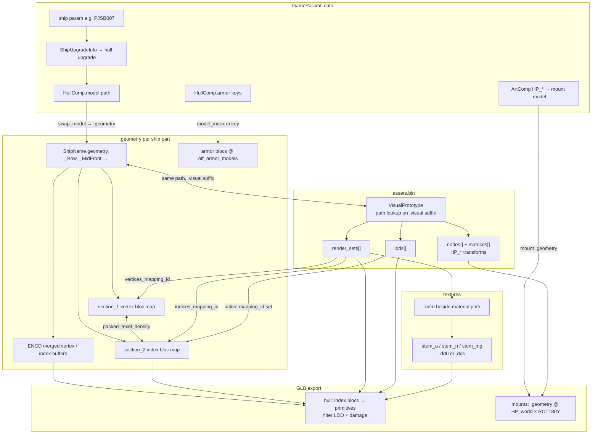
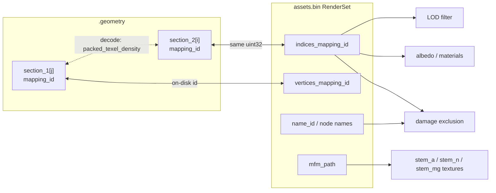
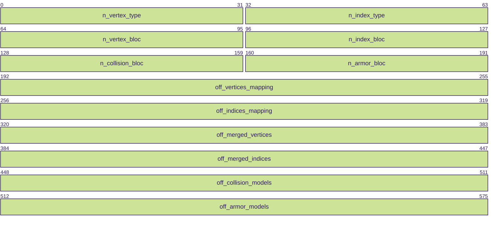
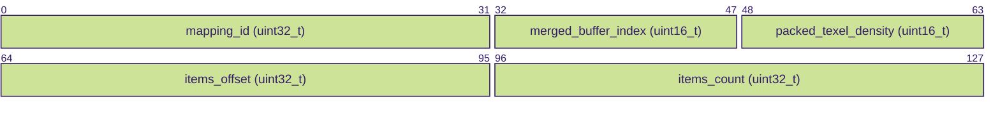
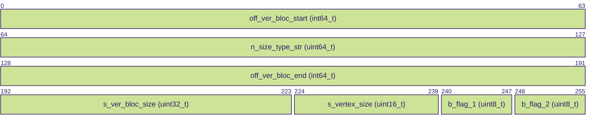
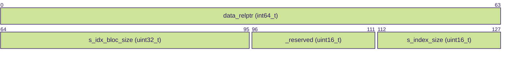

# WoWs `.geometry` format

Reference for the BigWorld `.geometry` container used by World of Warships, plus
related game files (`GameParams.data`, `assets.bin`, textures). Vertex and index
payloads are stored in **ENCD** blocks compressed with [meshoptimizer](https://github.com/zeux/meshoptimizer).

## Overview — linking game files to a ship GLB

How `GameParams.data`, `.geometry` / `.visual`, `assets.bin`, and textures fit
together. Cross-references below match `wows-gltf-exporter` (`lib/stitch.cpp`,
`lib/ship_export.cpp`). Armor blocs are documented in the format but not yet read
by the exporter.


```mermaid
flowchart TB
    subgraph GP["GameParams.data"]
        ship["ship param e.g. PJSB007"]
        upgrade["ShipUpgradeInfo → hull upgrade"]
        hullModel["HullComp.model path"]
        armorGP["HullComp.armor keys"]
        mountsGP["ArtComp HP_* → mount .model"]
    end

    subgraph GEO[".geometry per ship part"]
        geomFiles["ShipName.geometry, _Bow, _MidFront, …"]
        s1["section_1 vertex bloc map"]
        s2["section_2 index bloc map"]
        encd["ENCD merged vertex / index buffers"]
        armorGeo["armor blocs @ off_armor_models"]
    end

    subgraph AB["assets.bin"]
        visual["VisualPrototype<br/>path lookup on .visual suffix"]
        rs["render_sets[]"]
        lods["lods[]"]
        hpNodes["nodes[] + matrices[]<br/>HP_* transforms"]
    end

    subgraph TEX["textures"]
        mfm[".mfm beside material path"]
        dds["stem_a / stem_n / stem_mg<br/>.dd0 or .dds"]
    end

    subgraph OUT["GLB export"]
        hullOut["hull: index blocs → primitives<br/>filter LOD + damage"]
        mountOut["mounts: .geometry @ HP_world × ROT180Y"]
    end

    ship --> upgrade
    upgrade --> hullModel
    hullModel -->|"swap .model → .geometry"| geomFiles
    geomFiles --> s1
    geomFiles --> s2
    geomFiles --> encd
    s1 <-->|"packed_texel_density"| s2
    armorGP -->|"model_index in key"| armorGeo

    geomFiles <-->|"same path, .visual suffix"| visual
    visual --> rs
    visual --> lods
    visual --> hpNodes

    rs -->|"indices_mapping_id"| s2
    rs -->|"vertices_mapping_id"| s1
    rs --> mfm
    mfm --> dds
    lods -->|"active mapping_id set"| s2

    mountsGP -->|"mount .geometry"| mountOut
    hpNodes --> mountOut
    encd --> hullOut
    s2 --> hullOut
    rs --> hullOut
    lods --> hullOut
    dds --> hullOut
```

### Draw-call mapping IDs


```mermaid
flowchart LR
    subgraph geom[".geometry"]
        s2["section_2[i]<br/>mapping_id"]
        s1["section_1[j]<br/>mapping_id"]
    end

    subgraph abin["assets.bin RenderSet"]
        idx["indices_mapping_id"]
        vtx["vertices_mapping_id"]
        mfm["mfm_path"]
        names["name_id / node names"]
    end

    s2 <-->|"same uint32"| idx
    s1 <-->|"on-disk id"| vtx
    s1 <-.->|"decode: packed_texel_density"| s2
    idx --> lod["LOD filter"]
    idx --> tex["albedo / materials"]
    idx --> dmg["damage exclusion"]
    mfm --> dds["stem_a / stem_n / stem_mg textures"]
    names --> dmg
```

## Contents

- [Overview — linking game files to a ship GLB](#overview--linking-game-files-to-a-ship-glb)
  - [Draw-call mapping IDs](#draw-call-mapping-ids)
- [File layout](#file-layout)
- [Binary structures](#binary-structures)
- [Ship parts, LOD, and coordinates](#ship-part-files-and-lod)
- [Related files](#related-files)

## File layout

```
[Header 72 bytes]
[Vertex Bloc Mapping table: n_vertex_bloc × 16 bytes]    ← at off_vertices_mapping (always 72)
[Index Bloc Mapping table:  n_index_bloc  × 16 bytes]    ← at off_indices_mapping
[Vertex Type Metadata:      n_vertex_type × 32 bytes]    ← at off_merged_vertices
[Index Type Metadata:       n_index_type  × 16 bytes]    ← at off_merged_indices
[ENCD vertex data blocs]    ← pointed to by Vertex Type Metadata
[ENCD index data blocs]     ← pointed to by Index Type Metadata
[Collision model data]      ← at off_collision_models (if n_collision_bloc > 0)
[Armor model data]          ← at off_armor_models (if n_armor_bloc > 0)
```

## Binary structures

### Header (72 bytes)


```mermaid
%%{init: { 'theme': 'forest', 'config': {'bitsPerRow': 64, 'bitWidth': 15}}}%%
packet-beta
0-31: "n_vertex_type"
32-63: "n_index_type"
64-95: "n_vertex_bloc"
96-127: "n_index_bloc"
128-159: "n_collision_bloc"
160-191: "n_armor_bloc"
192-255: "off_vertices_mapping"
256-319: "off_indices_mapping"
320-383: "off_merged_vertices"
384-447: "off_merged_indices"
448-511: "off_collision_models"
512-575: "off_armor_models"
```

| Field                  | Size    | Description                                              |
|------------------------|---------|----------------------------------------------------------|
| `n_vertex_type`        | 32 bits | Number of merged vertex buffers                          |
| `n_index_type`         | 32 bits | Number of merged index buffers                           |
| `n_vertex_bloc`        | 32 bits | Number of vertex bloc mapping entries (submesh count)    |
| `n_index_bloc`         | 32 bits | Number of index bloc mapping entries (submesh count)     |
| `n_collision_bloc`     | 32 bits | Number of collision blocs                                |
| `n_armor_bloc`         | 32 bits | Number of armor blocs                                    |
| `off_vertices_mapping` | 64 bits | Absolute offset to vertex bloc mapping table (always 72) |
| `off_indices_mapping`  | 64 bits | Absolute offset to index bloc mapping table              |
| `off_merged_vertices`  | 64 bits | Absolute offset to vertex type metadata array            |
| `off_merged_indices`   | 64 bits | Absolute offset to index type metadata array             |
| `off_collision_models` | 64 bits | Absolute offset to collision model data (0 if none)      |
| `off_armor_models`     | 64 bits | Absolute offset to armor model data (0 if none)          |

### Vertex / index bloc mapping (16 bytes each)

Array of `n_vertex_bloc` (or `n_index_bloc`) entries describing individual submesh
ranges within the merged vertex/index buffers.


```mermaid
%%{init: { 'theme': 'forest', 'config': {'bitsPerRow': 64, 'bitWidth': 15}}}%%
packet-beta
0-31: "mapping_id (uint32_t)"
32-47: "merged_buffer_index (uint16_t)"
48-63: "packed_texel_density (uint16_t)"
64-95: "items_offset (uint32_t)"
96-127: "items_count (uint32_t)"
```

| Field                  | Size      | Description                                              |
|------------------------|-----------|----------------------------------------------------------|
| `mapping_id`           | 32 bits   | Submesh identifier hash (matches `RenderSet.vertices_mapping_id` / `indices_mapping_id` in assets.bin) |
| `merged_buffer_index`  | 16 bits   | Index into vertex/index type metadata array              |
| `packed_texel_density` | 16 bits   | Draw-call pairing key: groups vertex and index bloc entries that belong to the same draw call |
| `items_offset`         | 32 bits   | Starting element index within the merged buffer          |
| `items_count`          | 32 bits   | Number of elements (vertices or indices) for this submesh |

### Draw-call matching

The `packed_texel_density` field in both vertex and index bloc mapping entries is the
key that pairs them into a draw call. Within a `packed_texel_density` group:

1. Sort all **vertex** bloc entries by `items_count DESC`, `items_offset ASC`.
2. Sort all **index** bloc entries by `items_count DESC`, `items_offset ASC`.
3. The k-th index entry maps to the k-th vertex entry.

Index values stored in each index bloc are zero-based relative to that draw call's
vertex base (`section_1[j].items_offset`).  When exporting, absolute vertex indices
are computed as `raw_index + vertex_base`.

### Vertex type metadata (32 bytes each)

Array of `n_vertex_type` entries. Each describes a merged vertex buffer.
All pointer fields are relative to the struct base address.


```mermaid
%%{init: { 'theme': 'forest', 'config': {'bitsPerRow': 64, 'bitWidth': 15}}}%%
packet-beta
0-63: "off_ver_bloc_start (int64_t)"
64-127: "n_size_type_str (uint64_t)"
128-191: "off_ver_bloc_end (int64_t)"
192-223: "s_ver_bloc_size (uint32_t)"
224-239: "s_vertex_size (uint16_t)"
240-247: "b_flag_1 (uint8_t)"
248-255: "b_flag_2 (uint8_t)"
```

| Field                | Size     | Description                                                     |
|----------------------|----------|-----------------------------------------------------------------|
| `off_ver_bloc_start` | 64 bits  | Relative pointer from struct base to ENCD vertex bloc start     |
| `n_size_type_str`    | 64 bits  | Byte length of the vertex type name (e.g. `set3/xyznuvtbpc`)    |
| `off_ver_bloc_end`   | 64 bits  | Relative pointer from struct base to ENCD vertex bloc end       |
| `s_ver_bloc_size`    | 32 bits  | Total ENCD bloc size in bytes (includes 8-byte ENCD header)     |
| `s_vertex_size`      | 16 bits  | Vertex stride in bytes (decoded size per vertex)                |
| `b_flag_1`           | 8 bits   | Reserved flag byte                                              |
| `b_flag_2`           | 8 bits   | Reserved flag byte                                              |

The vertex type name is a null-terminated string at `struct_base + off_ver_bloc_end + 8`
(all relative pointers are resolved from each metadata entry’s base address).

### Index type metadata (16 bytes each)

Array of `n_index_type` entries. Each describes a merged index buffer.


```mermaid
%%{init: { 'theme': 'forest', 'config': {'bitsPerRow': 64, 'bitWidth': 15}}}%%
packet-beta
0-63: "data_relptr (int64_t)"
64-95: "s_idx_bloc_size (uint32_t)"
96-111: "_reserved (uint16_t)"
112-127: "s_index_size (uint16_t)"
```

| Field              | Size    | Description                                                       |
|--------------------|---------|-------------------------------------------------------------------|
| `data_relptr`      | 64 bits | Relative pointer from struct base to ENCD index bloc              |
| `s_idx_bloc_size`  | 32 bits | Total ENCD bloc size in bytes (includes 8-byte ENCD header)       |
| `_reserved`        | 16 bits | Reserved / padding                                                |
| `s_index_size`     | 16 bits | Bytes per index: 2 (uint16) or 4 (uint32)                         |

### ENCD block

Vertex and index payloads share the same ENCD container, compressed with meshoptimizer.

```
[4 bytes] magic = 0x44434E45 ("ENCD" as little-endian uint32)
[4 bytes] element_count (uint32 LE) — number of vertices or indices
[N bytes] meshoptimizer-encoded payload
```

Decoding:
- Vertices: `meshopt_decodeVertexBuffer(dst, element_count, stride, payload, payload_size)`
- Indices: `meshopt_decodeIndexBuffer(dst_u32, element_count, 4, payload, payload_size)`
  then downcast each u32 to u16 if `s_index_size == 2`.

If the magic does not match `ENCD`, the bloc is treated as raw (uncompressed) data.

### Vertex layout (after ENCD decode)

Vertices are tightly packed at `s_vertex_size` bytes each. Fields present depend on
the vertex type name. All multi-byte values are little-endian.

#### Attribute encoding

| Attribute   | Size   | Encoding                                                              |
|-------------|--------|-----------------------------------------------------------------------|
| xyz         | 12 B   | 3 × IEEE 754 float32                                                  |
| n / t / b   | 4 B    | 4 signed bytes, each component = `(int8_t)byte / 127.0f`             |
| uv          | 4 B    | 2 × IEEE 754 float16; stored as `actual_uv - 0.5`, load with `+0.5`  |
| iiiww       | 8 B    | 3 bone indices (raw uint8 ×3) + 2 bone weights (raw), 4 B each field |
| r           | 4 B    | Raw uint32 (extra data, use varies)                                   |
| pc          | 0 B    | Per-vertex color flag only — no bytes in buffer                       |

#### Vertex type layouts

| Vertex type             | Stride | Layout (bytes)                                        |
|-------------------------|--------|-------------------------------------------------------|
| `set3/xyznuvpc`         | 20     | xyz(12) + n(4) + uv(4)                                |
| `set3/xyznuvrpc`        | 24     | xyz(12) + n(4) + uv(4) + r(4)                         |
| `set3/xyznuvtbpc`       | 28     | xyz(12) + n(4) + uv(4) + t(4) + b(4)                  |
| `set3/xyznuviiiwwpc`    | 28     | xyz(12) + n(4) + uv(4) + iiiww(8)                     |
| `set3/xyznuv2tbpc`      | 32     | xyz(12) + n(4) + uv0(4) + uv1(4) + t(4) + b(4)        |
| `set3/xyznuvtbipc`      | 32     | xyz(12) + n(4) + uv(4) + t(4) + b(4) + i(4)           |
| `set3/xyznuvtboi`       | 32     | xyz(12) + n(4) + uv(4) + t(4) + b(4) + oi(4)          |
| `set3/xyznuviiiwwr`     | 32     | xyz(12) + n(4) + uv(4) + iiiww(8) + r(4)              |
| `set3/xyznuv2tbipc`     | 36     | xyz(12) + n(4) + uv0(4) + uv1(4) + t(4) + b(4) + i(4) |
| `set3/xyznuviiiwwtbpc`  | 36     | xyz(12) + n(4) + uv(4) + iiiww(8) + t(4) + b(4)       |
| `set3/xyznuv2iiiwwtbpc` | 40     | xyz(12) + n(4) + uv0(4) + uv1(4) + iiiww(8) + t(4) + b(4) |

### Collision model data

Present when `n_collision_bloc > 0` at `off_collision_models`.

The binary format is **not yet fully reversed**. What is known:

- The number of blocs is `n_collision_bloc`.
- The section holds simplified hull geometry used for physics collision detection.

### Armor model data

Present when `n_armor_bloc > 0` at `off_armor_models`.

The binary format is **not yet fully reversed**. What is known:

- The number of blocs is `n_armor_bloc`.
- Each bloc represents a named armor zone (plate) with an associated geometry.
- Thickness values and material IDs come from `GameParams.data` (see below),
  not from the `.geometry` file itself.

---

## Ship part files and LOD

### File naming

A ship's geometry is split across multiple `.geometry` files in the same directory:

```
content/gameplay/japan/ship/battleship/JSB007_Kongo_1942/
    JSB007_Kongo_1942.geometry          ← low-poly LOD placeholder (whole-ship bounding mesh)
    JSB007_Kongo_1942_Bow.geometry      ← detailed bow section
    JSB007_Kongo_1942_MidFront.geometry ← detailed mid-front section
    JSB007_Kongo_1942_MidBack.geometry  ← detailed mid-back section
    JSB007_Kongo_1942_Stern.geometry    ← detailed stern section
    ...
```

The bare base file (same name as the directory) is a low-detail stand-in used at
extreme camera distances. The suffixed part files (`_Bow`, `_MidFront`, etc.) hold
the actual high-detail mesh.  All parts share the same ship coordinate space and can
be merged directly without any transform.

A corresponding `.visual` file exists for each `.geometry` file at the same path.
The `.visual` path is the key used to look up the `VisualPrototype` record in
`assets.bin`.

### Render-set LOD (in `assets.bin`)

Within a single part file, multiple detail levels are expressed as groups of render
sets in the `VisualPrototype` record (see [VisualPrototype](#visualprototype)).
Each LOD entry lists which render sets (identified by `indices_mapping_id`) belong
to that detail level:

| LOD level | Description                                     |
|-----------|-------------------------------------------------|
| 0         | Highest detail (full geometry + normal maps)    |
| 1         | Medium detail                                   |
| 2         | Low detail                                      |
| 3         | Lowest detail / impostor                        |

A render set's `indices_mapping_id` matches the `mapping_id` field in the index
bloc mapping table of the `.geometry` file.  This is how LOD filtering maps directly
onto primitive selection during export.

### Damage and cross-section geometry

Ships split into sections on sinking.  Each break point has associated geometry:

| Node name pattern          | Role                                                        |
|----------------------------|-------------------------------------------------------------|
| `Xxx_crack_YYY_DeckHouse`  | Exterior deckhouse face at break joint (visible at all times) |
| `Xxx_crack_YYY_Hull`       | Exterior hull face at break joint (visible at all times)    |
| `Xxx_crack_YYY_in`         | Inner cross-section face revealed when the ship splits (damage) |
| `Xxx_crack_YYY`            | Inner/cross-section face (bare name, no suffix) (damage)    |
| `Xxx_hide`                 | Hidden torn-metal mesh revealed on break (damage)           |

Node names are stored in the `VisualPrototype` and resolved via the strings section
of `assets.bin`.  Render sets associated with `_hide` or `_crack_*` nodes (except
`_DeckHouse` variants) are considered damage geometry.

Damage materials also identify damage primitives:
- `*Razlom*` — torn-metal texture used at break surfaces
- `*C011_Grid*` — grid/alpha overlay used at break points

### Coordinate system

- **Y-up**, right-hand coordinate system (BigWorld convention).
- Ship faces **bow toward −Z**.
- Turret/gun models face **stern (+Z)** in their local space; a 180° Y-axis
  rotation is required to align them with the hull when placing at HP_ hardpoints.
- HP_ hardpoint transforms in `assets.bin` are world-space, column-major 4×4
  `float32` matrices.

---

## Related files

### `GameParams.data`

**Format:** `reverse(zlib(pickle(root_dict)))`

The bytes of the file are stored in reverse order; reversing and zlib-decompressing
yields a Python pickle.  The root object is either a `dict` with an `""` key (older
builds) or a `list` whose first element is the param dict (newer builds).

Each ship entry is keyed by its param name (e.g. `PJSB007`, `PASC013`).  Ship
entries have `typeinfo.type == "Ship"` and contain:

| Field              | Description                                                          |
|--------------------|----------------------------------------------------------------------|
| `ShipUpgradeInfo`  | Dict of hull/weapon upgrade configs                                  |
| `<HullCompName>`   | Hull component dict: `model` path, `visibilityFactor`, `armor`, etc. |
| `<ArtilleryComp>`  | Artillery component dict: `HP_*` mount points with model paths       |
| `<TorpedoComp>`    | Torpedo component dict: `HP_*` mount points                          |

The `model` field inside a hull component is a path like:

```
content/gameplay/japan/ship/battleship/JSB007_Kongo_1942/JSB007_Kongo_1942.model
```

Replace the `.model` suffix with `.geometry` to obtain the geometry file path
relative to the game root directory.

#### Armor key encoding

The `armor` dict inside a hull component uses integer keys:

```
key   = (model_index << 16) | material_id
value = thickness in mm (float)
```

- `model_index` — zero-based index into the armor model blocs in the `.geometry` file.
- `material_id` — armor surface material (determines penetration/bounce behaviour).

---

### `assets.bin` (BigWorld PrototypeDatabase)

`assets.bin` is the BigWorld `PrototypeDatabase` binary format.  It stores
pre-compiled scene-graph data (visual prototypes) for all game objects.

#### File header (16 bytes)

| Offset | Size | Field          | Value / Notes                             |
|--------|------|----------------|-------------------------------------------|
| 0      | 4    | `magic`        | `0x42574442` (`"BWDB"` LE)                |
| 4      | 4    | `version`      | `0x01010000`                              |
| 8      | 4    | `checksum`     | CRC of the body                           |
| 12     | 2    | `architecture` |                                           |
| 14     | 2    | `endianness`   |                                           |

Body starts at offset `0x10`.

#### Body layout

| Base offset | Size   | Section            |
|-------------|--------|--------------------|
| `0x10`      | `0x28` | Strings section    |
| `0x38`      | `0x18` | R2P (record-to-path) map |
| `0x50`      | `0x10` | Path storage       |
| `0x60`      | —      | Databases array    |

All sections use relative pointers (`int64_t`, signed, from the field's own address).

#### Strings section (base = `0x10`)

Open-addressing hashmap mapping `uint32_t` name IDs to null-terminated UTF-8 strings.

| Offset in section | Field              | Description                               |
|-------------------|--------------------|-------------------------------------------|
| 0                 | `capacity (u32)`   | Number of buckets                         |
| 4                 | pad                |                                           |
| 8                 | `buckets_relptr`   | → array of `[u32 key, u32 sentinel]` pairs |
| 16                | `values_relptr`    | → array of `u32` byte offsets into string data |
| 24                | `string_data_size` | Size of string data blob in bytes         |
| 28                | pad                |                                           |
| 32                | `string_data_relptr` | → null-terminated strings                |

Lookup: probe `(key % capacity + i) % capacity` until `key` matches or bucket is empty
(both fields zero).

#### R2P map (base = `0x38`)

Maps path `self_id (uint64_t)` to a packed `uint32_t` value encoding the blob and
record where the prototype data lives.

| Offset in section | Field             | Description                                        |
|-------------------|-------------------|----------------------------------------------------|
| 0                 | `capacity (u32)`  | Number of buckets                                  |
| 4                 | pad               |                                                    |
| 8                 | `buckets_relptr`  | → array of `[u64 key, u64 sentinel]` pairs (16 B each) |
| 16                | `values_relptr`   | → array of `u32` packed values                     |

Packed value decoding:

```
blob_index   = (value & 0xFF) // 4
record_index = value >> 8
```

#### Path storage (base = `0x50`)

Flat array of path entries (32 bytes each):

| Offset in entry | Field          | Description                                              |
|-----------------|----------------|----------------------------------------------------------|
| 0               | `self_id`      | `uint64_t` unique ID for this path node                  |
| 8               | `parent_id`    | `uint64_t` ID of the parent node (`0` = root)            |
| 16              | packed string  | Node name (BigWorld packed string: `u32 char_count`, 4 B pad, `i64 text_relptr`) |

Full paths are reconstructed by walking parent links.  A `.visual` path suffix
(e.g. `JSB007_Kongo_1942/JSB007_Kongo_1942.visual`) is the lookup key.

#### Databases array (base = `0x60` in body; relptr base = body base)

Array of database entries (0x18 bytes each):

| Offset in entry | Field              | Description                              |
|-----------------|--------------------|------------------------------------------|
| 0               | `proto_magic`      | Prototype type magic (u32)               |
| 4               | `proto_checksum`   | (u32)                                    |
| 8               | `size`             | Byte size of the blob (u32)              |
| 12              | pad                |                                          |
| 16              | `data_relptr`      | `i64` relative to entry base → blob      |

Each blob starts with a `uint64_t` record count, followed by fixed-size records.
**Blob index 1** holds `VisualPrototype` records (item size = `0x70`).

#### VisualPrototype

Record format (item size `0x70 = 112` bytes):

| Offset | Size | Field                    | Description                                              |
|--------|------|--------------------------|----------------------------------------------------------|
| 0      | 4    | `nodes_count`            | Number of scene-graph nodes                              |
| 4      | 4    | pad                      |                                                          |
| 8      | 8    | `name_map_name_ids_rp`   | `i64` relptr → `u32[]` name IDs (length = nodes_count)   |
| 16     | 8    | `name_map_node_ids_rp`   | `i64` relptr → `u16[]` node indices                      |
| 24     | 8    | `name_ids_rp`            | `i64` relptr → `u32[]` name IDs (one per node)           |
| 32     | 8    | `matrices_rp`            | `i64` relptr → 16×`f32` column-major matrices (64 B each)|
| 40     | 8    | `parent_ids_rp`          | `i64` relptr → `u16[]` parent indices (`0xFFFF` = root)  |
| 48     | 8    | `merged_geom_path_id`    | `u64` path ID of the merged geometry resource            |
| 56     | 1    | `underwater_model`       | `u8`                                                     |
| 57     | 1    | `abovewater_model`       | `u8`                                                     |
| 58     | 2    | `render_sets_count`      | `u16`                                                    |
| 60     | 1    | `lods_count`             | `u8`                                                     |
| 61     | 3    | pad                      |                                                          |
| 64     | 32   | BoundingBox              | min + max as 2 × `vec3f32` + 2 × 4 B pad                |
| 96     | 8    | `render_sets_rp`         | `i64` relptr → RenderSet array                           |
| 104    | 8    | `lods_rp`                | `i64` relptr → LOD entry array                           |

World-space transform for a node = product of local matrices from root to node
(column-major, right-to-left multiplication).

#### RenderSet (0x28 = 40 bytes each)

| Offset | Size | Field                   | Description                                                    |
|--------|------|-------------------------|----------------------------------------------------------------|
| 0      | 4    | `name_id`               | `u32` name string ID (render set name)                         |
| 4      | 4    | `mat_name_id`           | `u32` material name string ID                                  |
| 8      | 4    | `vertices_mapping_id`   | `u32` matches `mapping_id` in vertex bloc mapping table        |
| 12     | 4    | `indices_mapping_id`    | `u32` matches `mapping_id` in index bloc mapping table         |
| 16     | 8    | `mfm_path_id`           | `u64` path ID of the `.mfm` material file                      |
| 24     | 1    | `skinned`               | `u8`                                                           |
| 25     | 1    | `nodes_count`           | `u8` number of bone nodes                                      |
| 26     | 6    | pad                     |                                                                |
| 32     | 8    | `node_name_ids_rp`      | `i64` relptr → `u32[]` node name IDs                           |

#### LOD entry (16 bytes each)

| Offset | Size | Field           | Description                                                  |
|--------|------|-----------------|--------------------------------------------------------------|
| 0      | 4    | `dist_threshold`| `f32` camera distance threshold for this LOD level           |
| 4      | 2    | unknown         | `u16`                                                        |
| 6      | 2    | `rs_count`      | `u16` number of render sets in this LOD                      |
| 8      | 8    | `rs_names_rp`   | `i64` relptr from **this entry's base** → `u32[]` name IDs   |

Name IDs reference render sets by their `name_id` field. Resolved to
`indices_mapping_id` for LOD-based primitive filtering.

---

### Texture files

Textures live in the same directory as the `.mfm` file they are referenced from.
The stem is derived from the MFM filename (minus the `.mfm` extension and optional
MFM-only suffixes: `_skinned`, `_alpha`, `_ep`).

| Suffix | Channel                  | glTF slot                      |
|--------|--------------------------|--------------------------------|
| `_a`   | Albedo / base color       | `baseColorTexture`             |
| `_n`   | Normal map                | `normalTexture`                |
| `_mg`  | Metallic/gloss            | `metallicRoughnessTexture`     |

File extensions in priority order: `.dd0` (highest resolution MIP set), `.dd1`,
`.dds`.  All are standard DDS containers.

UV orientation: BigWorld stores V with origin at the bottom; DDS textures are stored
top-to-bottom.  Correct display requires flipping V: `v_display = 1.0 - v_stored`.
In glTF this is expressed with `KHR_texture_transform`: `scale=[1,-1], offset=[0,1]`.
