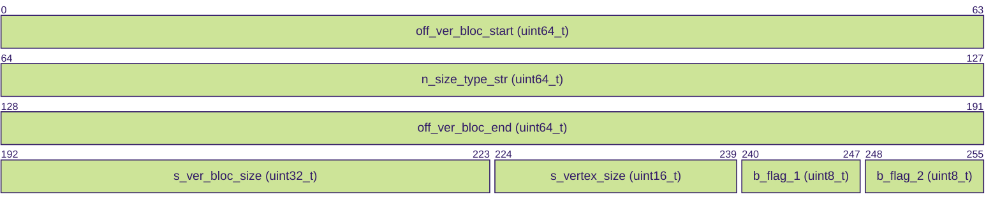

# WoWs .geometry Format.

## Introduction

TODO

## Format

### Header

| Field                      | Size    | Description                                                                                     |
|----------------------------|---------|-------------------------------------------------------------------------------------------------|
| `n_vertex_type`            | 32 bits | Number of vertex types                                                                          |
| `n_index_type`             | 32 bits | Number of index types                                                                           |
| `n_vertex_bloc`            | 32 bits | Number of vertex blocs                                                                          |
| `n_index_bloc`             | 32 bits | Number of index blocs                                                                           |
| `n_collision_bloc`         | 32 bits | Number of collision blocs                                                                       |
| `n_armor_bloc`             | 32 bits | Number of armor blocs                                                                           |
| `offset_1`                 | 64 bits | Offset to data start (always 72 bytes)                                                          |
| `unknown_1`                | 64 bits | Multiple of 8/64bits, value between ~80 and ~1200  | offset?                                    |
| `unknown_2`                | 64 bits | Multiple of 8/64bits, value between ~100 and ~2000 | offset?                                    |
| `unknown_3`                | 64 bits | Large value (few thousands to millions) | vertex count?                                         |
| `unknown_4`                | 64 bits | Large value (few thousands to millions), 0 if no collision bloc | vertex count collision block? |
| `unknown_5`                | 64 bits | Large value (few thousands to millions), 0 if no armor bloc     | vertex count armor block?     |

### Metadata

| Field           | Size      | Description                              |
|-----------------|-----------|------------------------------------------|
| `id_unk_6`      | 32 bits   | Unknown field, possibly an identifier    |
| `type_unk_7`    | 16 bits   | Unknown field, possibly a type value     |
| `id_unk_8`      | 16 bits   | Unknown field, possibly an identifier    |
| `n_unk_9`       | 32 bits   | Unknown field, related to count or index |
| `n_unk_10`      | 32 bits   | Unknown field, related to count or index |

### Metadata 2

| Field                | Size      | Description                                                                         |
|----------------------|-----------|-------------------------------------------------------------------------------------|
| `off_ver_bloc_start` | 64 bits   | Offset to the corresponding vertex section relative to this current block           |
| `n_size_type_str`    | 64 bits   | Size of the vertex type string (e.g., len(set3/xyznuviiiwwtbpc))                    |
| `off_ver_bloc_end`   | 64 bits   | Offset to the end of the corresponding vertex block                                 |
| `s_ver_bloc_size`    | 32 bits   | Size of the vertex block                                                            |
| `s_vertex_size`      | 16 bits   | Vertex Size                                                                         |
| `b_flag_1`           | 8 bits    | Boolean flag (maybe float packing format?                                           |
| `b_flag_2`           | 8 bits    | Boolean flag                                                                        |

### Vertex Types

| vertex type           | count | vertex size | flag 1 | flag 2 |
|-----------------------|-------|-------------|--------|--------|
| set3/xyznuvpc         | 3012  | 20          | 0      | 0      |
| set3/xyznuvrpc        | 6689  | 24          | 0      | 0      |
| set3/xyznuvtbpc       | 81930 | 28          | 0      | 1      |
| set3/xyznuviiiwwpc    | 272   | 28          | 1      | 0      |
| set3/xyznuv2tbpc      | 666   | 32          | 0      | 1      |
| set3/xyznuvtbipc      | 300   | 32          | 0      | 1      |
| set3/xyznuvtboi       | 1     | 32          | 0      | 1      |
| set3/xyznuviiiwwr     | 88    | 32          | 1      | 0      |
| set3/xyznuv2tbipc     | 4     | 36          | 0      | 1      |
| set3/xyznuviiiwwtbpc  | 4502  | 36          | 1      | 1      |
| set3/xyznuv2iiiwwtbpc | 14    | 40          | 1      | 1      |

