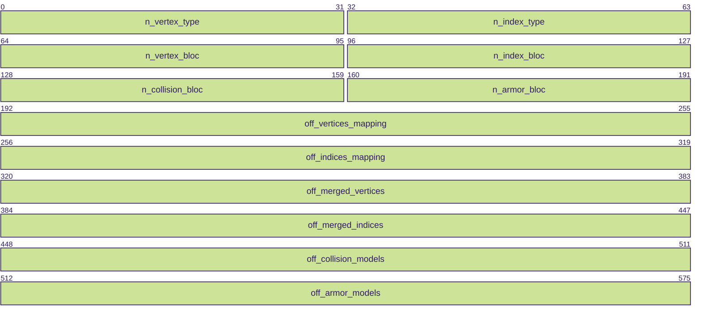
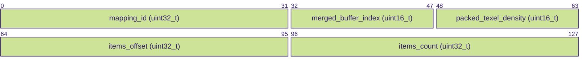
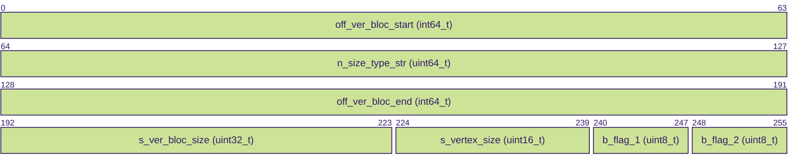
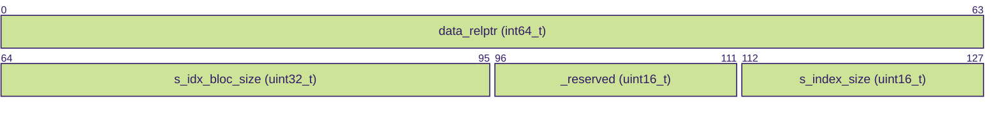

# WoWs `.geometry` file format

Binary layout of the BigWorld `.geometry` container: merged vertex/index buffers,
draw-call mapping tables, and **ENCD** payloads compressed with
[meshoptimizer](https://github.com/zeux/meshoptimizer).

How this file connects to `GameParams.data`, `assets.bin`, and export is described in
[MODEL.md](MODEL.md).

## Contents

- [File layout](#file-layout)
- [Binary structures](#binary-structures)
- [Collision and armor sections](#collision-model-data)

## File layout

```
[Header 72 bytes]
[Vertex Bloc Mapping table: n_vertex_bloc × 16 bytes]    ← at off_vertices_mapping (always 72)
[Index Bloc Mapping table:  n_index_bloc  × 16 bytes]    ← at off_indices_mapping
[Vertex Type Metadata:      n_vertex_type × 32 bytes]    ← at off_merged_vertices
[Index Type Metadata:       n_index_type  × 16 bytes]    ← at off_merged_indices
[ENCD vertex data blocs]    ← pointed to by Vertex Type Metadata
[ENCD index data blocs]     ← pointed to by Index Type Metadata
[Collision model data]      ← at off_collision_models (if n_collision_bloc > 0)
[Armor model data]          ← at off_armor_models (if n_armor_bloc > 0)
```

## Binary structures

### Header (72 bytes)



| Field                  | Size    | Description                                              |
|------------------------|---------|----------------------------------------------------------|
| `n_vertex_type`        | 32 bits | Number of merged vertex buffers                          |
| `n_index_type`         | 32 bits | Number of merged index buffers                           |
| `n_vertex_bloc`        | 32 bits | Number of vertex bloc mapping entries (submesh count)    |
| `n_index_bloc`         | 32 bits | Number of index bloc mapping entries (submesh count)     |
| `n_collision_bloc`     | 32 bits | Number of collision blocs                                |
| `n_armor_bloc`         | 32 bits | Number of armor blocs                                    |
| `off_vertices_mapping` | 64 bits | Absolute offset to vertex bloc mapping table (always 72) |
| `off_indices_mapping`  | 64 bits | Absolute offset to index bloc mapping table              |
| `off_merged_vertices`  | 64 bits | Absolute offset to vertex type metadata array            |
| `off_merged_indices`   | 64 bits | Absolute offset to index type metadata array             |
| `off_collision_models` | 64 bits | Absolute offset to collision model data (0 if none)      |
| `off_armor_models`     | 64 bits | Absolute offset to armor model data (0 if none)          |

### Vertex / index bloc mapping (16 bytes each)

Array of `n_vertex_bloc` (or `n_index_bloc`) entries describing individual submesh
ranges within the merged vertex/index buffers.



| Field                  | Size      | Description                                              |
|------------------------|-----------|----------------------------------------------------------|
| `mapping_id`           | 32 bits   | Submesh identifier hash (matches `RenderSet.vertices_mapping_id` / `indices_mapping_id` in [assets.bin](MODEL.md#assetsbin-bigworld-prototypedatabase)) |
| `merged_buffer_index`  | 16 bits   | Index into vertex/index type metadata array              |
| `packed_texel_density` | 16 bits   | Draw-call pairing key: groups vertex and index bloc entries that belong to the same draw call |
| `items_offset`         | 32 bits   | Starting element index within the merged buffer          |
| `items_count`          | 32 bits   | Number of elements (vertices or indices) for this submesh |

### Draw-call matching

The `packed_texel_density` field in both vertex and index bloc mapping entries is the
key that pairs them into a draw call. Within a `packed_texel_density` group:

1. Sort all **vertex** bloc entries by `items_count DESC`, `items_offset ASC`.
2. Sort all **index** bloc entries by `items_count DESC`, `items_offset ASC`.
3. The k-th index entry maps to the k-th vertex entry.

Index values stored in each index bloc are zero-based relative to that draw call's
vertex base (`section_1[j].items_offset`). When exporting, absolute vertex indices
are computed as `raw_index + vertex_base`.

### Vertex type metadata (32 bytes each)

Array of `n_vertex_type` entries. Each describes a merged vertex buffer.
All pointer fields are relative to the struct base address.



| Field                | Size     | Description                                                     |
|----------------------|----------|-----------------------------------------------------------------|
| `off_ver_bloc_start` | 64 bits  | Relative pointer from struct base to ENCD vertex bloc start     |
| `n_size_type_str`    | 64 bits  | Byte length of the vertex type name (e.g. `set3/xyznuvtbpc`)    |
| `off_ver_bloc_end`   | 64 bits  | Relative pointer from struct base to ENCD vertex bloc end       |
| `s_ver_bloc_size`    | 32 bits  | Total ENCD bloc size in bytes (includes 8-byte ENCD header)     |
| `s_vertex_size`      | 16 bits  | Vertex stride in bytes (decoded size per vertex)                |
| `b_flag_1`           | 8 bits   | Reserved flag byte                                              |
| `b_flag_2`           | 8 bits   | Reserved flag byte                                              |

The vertex type name is a null-terminated string at `struct_base + off_ver_bloc_end + 8`
(all relative pointers are resolved from each metadata entry’s base address).

### Index type metadata (16 bytes each)

Array of `n_index_type` entries. Each describes a merged index buffer.



| Field              | Size    | Description                                                       |
|--------------------|---------|-------------------------------------------------------------------|
| `data_relptr`      | 64 bits | Relative pointer from struct base to ENCD index bloc              |
| `s_idx_bloc_size`  | 32 bits | Total ENCD bloc size in bytes (includes 8-byte ENCD header)       |
| `_reserved`        | 16 bits | Reserved / padding                                                |
| `s_index_size`     | 16 bits | Bytes per index: 2 (uint16) or 4 (uint32)                         |

### ENCD block

Vertex and index payloads share the same ENCD container, compressed with meshoptimizer.

```
[4 bytes] magic = 0x44434E45 ("ENCD" as little-endian uint32)
[4 bytes] element_count (uint32 LE) — number of vertices or indices
[N bytes] meshoptimizer-encoded payload
```

Decoding:
- Vertices: `meshopt_decodeVertexBuffer(dst, element_count, stride, payload, payload_size)`
- Indices: `meshopt_decodeIndexBuffer(dst_u32, element_count, 4, payload, payload_size)`
  then downcast each u32 to u16 if `s_index_size == 2`.

If the magic does not match `ENCD`, the bloc is treated as raw (uncompressed) data.

### Vertex layout (after ENCD decode)

Vertices are tightly packed at `s_vertex_size` bytes each. Fields present depend on
the vertex type name. All multi-byte values are little-endian.

#### Attribute encoding

| Attribute   | Size   | Encoding                                                              |
|-------------|--------|-----------------------------------------------------------------------|
| xyz         | 12 B   | 3 × IEEE 754 float32                                                  |
| n / t / b   | 4 B    | 4 signed bytes, each component = `(int8_t)byte / 127.0f`             |
| uv          | 4 B    | 2 × IEEE 754 float16; stored as `actual_uv - 0.5`, load with `+0.5`  |
| iiiww       | 8 B    | 3 bone indices (raw uint8 ×3) + 2 bone weights (raw), 4 B each field |
| r           | 4 B    | Raw uint32 (extra data, use varies)                                   |
| pc          | 0 B    | Per-vertex color flag only — no bytes in buffer                       |

#### Vertex type layouts

| Vertex type             | Stride | Layout (bytes)                                        |
|-------------------------|--------|-------------------------------------------------------|
| `set3/xyznuvpc`         | 20     | xyz(12) + n(4) + uv(4)                                |
| `set3/xyznuvrpc`        | 24     | xyz(12) + n(4) + uv(4) + r(4)                         |
| `set3/xyznuvtbpc`       | 28     | xyz(12) + n(4) + uv(4) + t(4) + b(4)                  |
| `set3/xyznuviiiwwpc`    | 28     | xyz(12) + n(4) + uv(4) + iiiww(8)                     |
| `set3/xyznuv2tbpc`      | 32     | xyz(12) + n(4) + uv0(4) + uv1(4) + t(4) + b(4)        |
| `set3/xyznuvtbipc`      | 32     | xyz(12) + n(4) + uv(4) + t(4) + b(4) + i(4)           |
| `set3/xyznuvtboi`       | 32     | xyz(12) + n(4) + uv(4) + t(4) + b(4) + oi(4)          |
| `set3/xyznuviiiwwr`     | 32     | xyz(12) + n(4) + uv(4) + iiiww(8) + r(4)              |
| `set3/xyznuv2tbipc`     | 36     | xyz(12) + n(4) + uv0(4) + uv1(4) + t(4) + b(4) + i(4) |
| `set3/xyznuviiiwwtbpc`  | 36     | xyz(12) + n(4) + uv(4) + iiiww(8) + t(4) + b(4)       |
| `set3/xyznuv2iiiwwtbpc` | 40     | xyz(12) + n(4) + uv0(4) + uv1(4) + iiiww(8) + t(4) + b(4) |

### Collision model data

Present when `n_collision_bloc > 0` at `off_collision_models`.

The binary format is **not yet fully reversed**. What is known:

- The number of blocs is `n_collision_bloc`.
- The section holds simplified hull geometry used for physics collision detection.

### Armor model data

Present when `n_armor_bloc > 0` at `off_armor_models`.

The binary format is **not yet fully reversed**. What is known:

- The number of blocs is `n_armor_bloc`.
- Each bloc represents a named armor zone (plate) with an associated geometry.
- Thickness values and material IDs come from `GameParams.data` ([armor key encoding](MODEL.md#armor-key-encoding)), not from the `.geometry` file itself.
